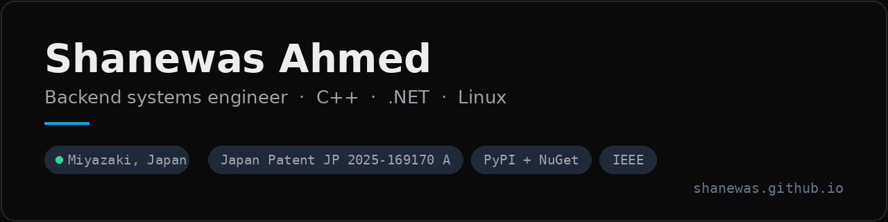

**Backend systems engineer at 株式会社スカイコム (SkyCom), R&D センター宮崎.** C++, C#, and Linux.

My day job is SkyPDF: low-level PDF parsing and cryptographic signing in C++ and C# on RHEL, along with the WebAPI, RPM packaging, and CI/CD wrapped around it. Chasing down a single API bottleneck doubled throughput in production. The My Number Card signing work turned into a patent, filed jointly with SkyCom in 2025.

Outside of that I build automation that has to survive the open internet — anti-bot systems and agents that run unattended for hours, and more recently giving those agents hands on the desktop itself. Several are packaged and public, so you can read the source and install them from PyPI, npm or NuGet.

Currently on a Japan Engineer visa in Miyazaki, looking for senior or lead backend, platform, or automation work in Tokyo or remote.

## Shipped

| Project | | What it is |
|---|---|---|
| **[agentic-stealth-browser](https://github.com/shanewas/agentic-stealth-browser)** |   | Stealth Playwright automation for autonomous agents: coherent TLS / navigator / WebGL / Canvas fingerprints, behaviour simulation, block detection with recovery, MCP server included. MIT. |
| **[edge-agent-bridge](https://github.com/shanewas/edge-agent-bridge)** |   | Drives the Edge tab you already have open, so sessions, VPNs and credentials survive. 9.09 ms P50 round trip; 50-action batches run 7.9× faster. Localhost-only, no telemetry, zero dependencies. MIT. |
| **[doppelhand](https://github.com/shanewas/doppelhand)** |   | Eyes and hands on a Windows desktop for any agent: screenshots plus real mouse and keyboard, one JSON object per command, no API key. 6 ms actions and 30 ms screenshots via DXGI Desktop Duplication; self-installs its own agent skill. MIT. |
| **[GhostScrape](https://ghostscrape.online)** | live | The hosted API built on that engine: FastAPI with key auth, usage metering and quotas, PostgreSQL 16, rotating proxies, systemd behind a Cloudflare Tunnel. |
| **[posix-ipc-dotnet](https://github.com/shanewas/posix-ipc-dotnet)** |   | System V shared memory and semaphores for .NET on Linux. Pure P/Invoke into libc, no native payload. .NET 6 / 8. MIT. |
| **[engram](https://github.com/shanewas/engram)** | | Memory for coding agents where a private git repo *is* the store and the audit log — every fact an attributed, revertible commit. No database, no service. |
| **[@shanewas/form-validation](https://github.com/shanewas/ValidationEngine)** |   | Rule-driven form validation for Node and the browser: cross-field dependencies, conditional rules, custom validators. GPL-3.0. |
| **[ats-resume-analyzer](https://github.com/shanewas/ats-resume-analyzer)** | | Scores a CV the way an applicant tracking system would: keyword matching, skill-gap detection, targeted rewrites. |
| **SkyPDF** | proprietary | The day job. C++/C# PDF and signing infrastructure on RHEL, running in enterprise document workflows. |

Smaller things that might be useful: [rpm-package](https://github.com/shanewas/rpm-package) (RPM packaging reference), [tunnelfox](https://github.com/shanewas/tunnelfox), [oci-defender](https://github.com/shanewas/oci-defender), [StructProbe](https://github.com/shanewas/StructProbe).

## Experience

**株式会社スカイコム (SkyCom Corporation)** — Software Engineer II → I · 2022 – present · Miyazaki, Japan  
Core developer on SkyPDF, the low-level PDF library and cryptographic signing infrastructure, in C++ and C# on RHEL. Designed the WebAPI surface for signing, rendering and conversion. Built the RPM packaging and CI/CD pipeline. Resolved a critical API bottleneck for a 2× throughput gain in production, and filed [JP 2025-169170 A](https://www.j-platpat.inpit.go.jp/) on electronic signatures using the My Number Card. Promoted to Grade I in April 2026.

**Ferntech Solutions** — Software Architect & Project Manager · 2019 – 2021 · Bangladesh  
Architected AIW Core, a hyper-automation platform deployed to major banks, then built the automation studio over it for desktop (Electron) and web against one shared engine. Led a five-person team through the full delivery lifecycle.

**Neonsofts** — Co-founder & Lead Developer · 2014 – 2017 · Bangladesh  
Started it while at BRAC University. ERP systems and Unity3D game prototypes for clients.

## Credentials

**Patent** · [JP 2025-169170 A](https://www.j-platpat.inpit.go.jp/) — Electronic signature system using the My Number Card. Japan Patent Office, filed 2025 with 株式会社スカイコム.

**Publications** · [Alzheimer's prediction via CNN on OCT retinal images](https://ieeexplore.ieee.org/document/9306649) (IEEE, 2019) · Arduino crop and fertilizer recommendation system (East West University Journal, 2018)

**Hackathon** · 1st place, National Hackathon, IDEB Bangladesh (2014)

## Stack

**Systems** C++ · C# / .NET Core · RHEL · systemd · RPM · P/Invoke · Win32 / COM via ctypes · Docker  
**Backend** FastAPI · Node.js · PostgreSQL · Redis · SQLite · REST  
**Automation & AI** Playwright · MCP · autonomous agents · multi-agent orchestration · TensorFlow / PyTorch · NLP  
**Also** Python · TypeScript · React · Bash · GitHub Actions

## Education

**BSc Computer Science** · BRAC University, Dhaka · 2013 – 2019  
**B-JET Advanced Course** · University of Miyazaki · 2021 – 2022  
**Microsoft Student Partner** · 2013 – 2016
