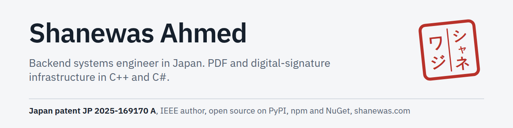

<picture>
  <source media="(prefers-color-scheme: dark)" srcset="assets/banner-dark.png">
  
</picture>

**Backend systems engineer in Japan.** I build PDF and digital-signature infrastructure in C++ and C# at SkyCom (株式会社スカイコム), and open-source tools for AI agents in my own time.

## About

My day job is SkyPDF: low-level PDF parsing and cryptographic signing in C++ and C# on RHEL, plus the WebAPI, RPM packaging and CI/CD around it. I tracked one API bottleneck through the stack and doubled its production throughput. The My Number Card signing work became a patent, filed jointly with SkyCom in 2025.

Outside work I build automation that has to survive the open internet: anti-bot systems, agents that run unattended for hours, and lately agents that can work a desktop with a real mouse and keyboard. The packages below are public, so you can read the source and install them.

I'm authorized to work in Japan and open to senior backend, platform or automation roles in Tokyo or remote. The contact details are on [shanewas.com](https://shanewas.com/#contact).

## Featured work

| Project | Release | What it does |
|---|---|---|
| **[agentic-stealth-browser](https://github.com/shanewas/agentic-stealth-browser)** |   | Browser automation for AI agents that holds up against bot detection: consistent TLS, navigator, WebGL and Canvas fingerprints, human-like input, block detection with recovery, and an MCP server. MIT. |
| **[edge-agent-bridge](https://github.com/shanewas/edge-agent-bridge)** |   | Lets a script or an agent drive the Edge tab you already have open, so logins and VPN sessions survive. 9 ms median round trip, and a 50-action batch runs 7.9× faster than single calls. Local only, no telemetry, no dependencies. MIT. |
| **[GhostScrape](https://ghostscrape.online)** | live | A hosted scraping API built on the stealth engine, with API keys, usage metering, quota billing and rotating proxies. I build and run it end to end. |

## Libraries and tools

| Project | Release | What it does |
|---|---|---|
| **[doppelhand](https://github.com/shanewas/doppelhand)** |  | Screenshots, mouse and keyboard on Windows for any agent, one JSON object per command. 6 ms actions through a warm local server. MIT. |
| **[posix-ipc-dotnet](https://github.com/shanewas/posix-ipc-dotnet)** |  | System V shared memory and semaphores for .NET 6 and 8 on Linux, through P/Invoke with no native payload. MIT. |
| **[engram](https://github.com/shanewas/engram)** |  | Memory for coding agents that syncs between machines, kept as reviewable commits in a private git repo. |
| **[@shanewas/form-validation](https://github.com/shanewas/ValidationEngine)** |  | Rule-driven form validation that behaves the same in Node and the browser: cross-field rules, conditions, custom validators. GPL-3.0. |
| **[ats-resume-analyzer](https://github.com/shanewas/ats-resume-analyzer)** | | Scores a CV the way an applicant tracking system would and suggests targeted rewrites. |

Smaller repos: [rpm-package](https://github.com/shanewas/rpm-package) (an RPM packaging reference), [tunnelfox](https://github.com/shanewas/tunnelfox), [oci-defender](https://github.com/shanewas/oci-defender) and [StructProbe](https://github.com/shanewas/StructProbe).

## Experience

**SkyCom Corporation (株式会社スカイコム)**, software engineer, 2022 to now, Japan 
Core developer on SkyPDF, the PDF library and signing infrastructure, in C++ and C# on RHEL. I designed the WebAPI for signing, rendering and conversion, built the RPM packaging and CI/CD pipeline, removed an API bottleneck for a 2× production throughput gain, and filed [JP 2025-169170 A](https://www.j-platpat.inpit.go.jp/) on electronic signatures with the My Number Card.

**Ferntech Solutions**, software architect and project manager, 2019 to 2021, Bangladesh 
Architected AIW Core, a hyper-automation platform deployed to five major banks, and the automation studio on top of it for desktop (Electron) and web, sharing one engine. Led a team of five from requirements to release.

**Neonsofts**, co-founder and lead developer, 2014 to 2017, Bangladesh 
Started it while at BRAC University. ERP systems and Unity3D game prototypes for clients.

## Research and recognition

- **Patent:** [JP 2025-169170 A](https://www.j-platpat.inpit.go.jp/), an electronic signature system using the My Number Card. Japan Patent Office, filed 2025 with SkyCom.
- **IEEE, 2019:** [Alzheimer's prediction with a CNN on OCT retinal images](https://ieeexplore.ieee.org/document/9306649).
- **East West University Journal, 2018:** an Arduino crop and fertilizer recommendation system.
- **Hackathon:** 1st place, National Hackathon, IDEB Bangladesh, 2014.

## Stack

| Area | Tools |
|---|---|
| Systems | C++, C# and .NET, RHEL, systemd, RPM, P/Invoke, Win32 and COM, Docker |
| Backend | FastAPI, Node.js, PostgreSQL, Redis, SQLite |
| Automation and AI | Playwright, MCP, agent systems, multi-agent orchestration, PyTorch and TensorFlow |
| Also | Python, TypeScript, React, Bash, GitHub Actions |

## Education

- **BSc in Computer Science**, BRAC University, 2013 to 2019
- **B-JET Advanced Course** (Japanese language and business practice for engineers), 2021 to 2022
- **Microsoft Student Partner**, 2013 to 2016
